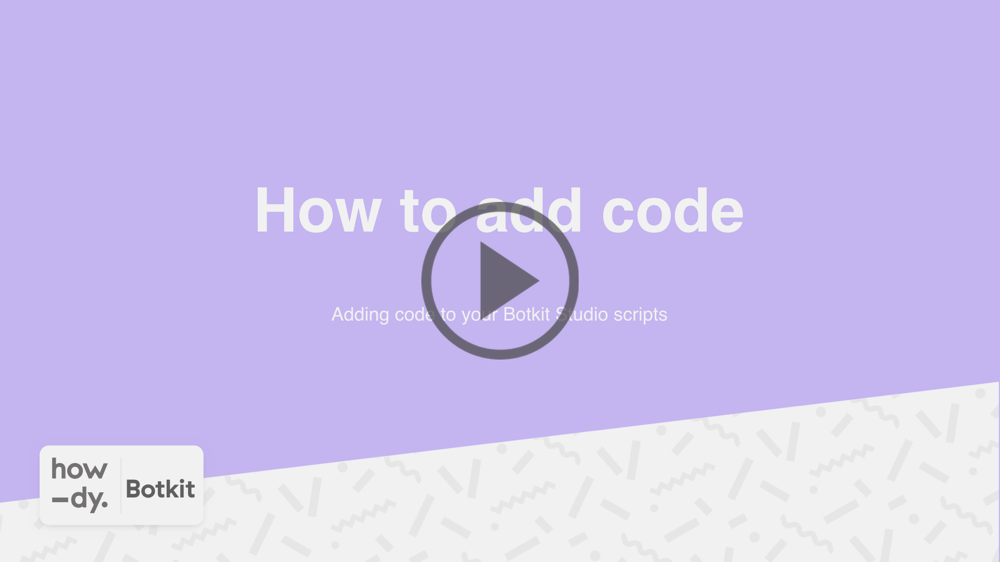

# Adding custom code to your Botkit application

Botkit’s SDK provides a hook for connecting code to the end of a conversation. By adding a simple module to your Botkit application, your application gains powerful abilities above and beyond simple conversation management.